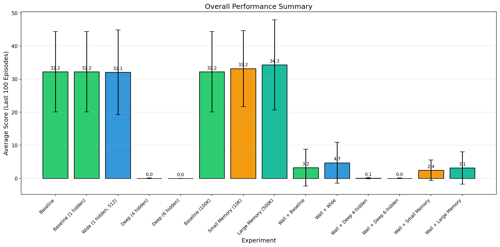
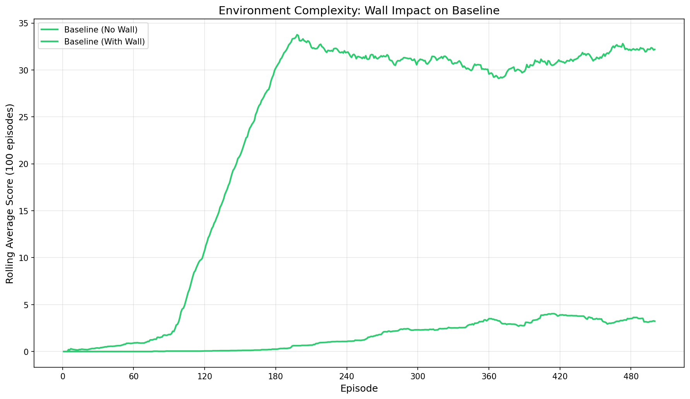
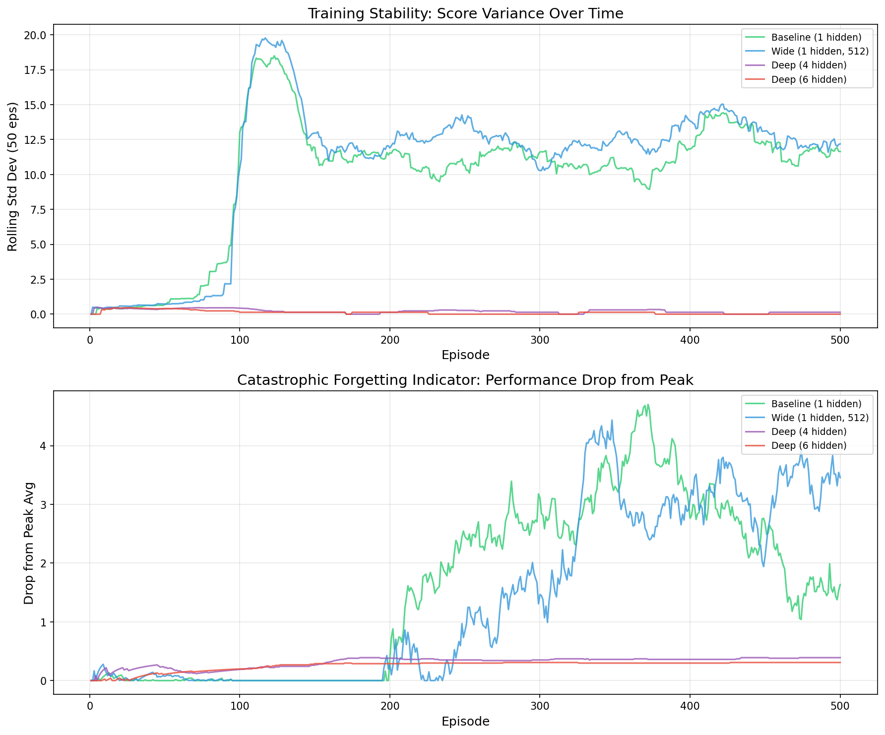
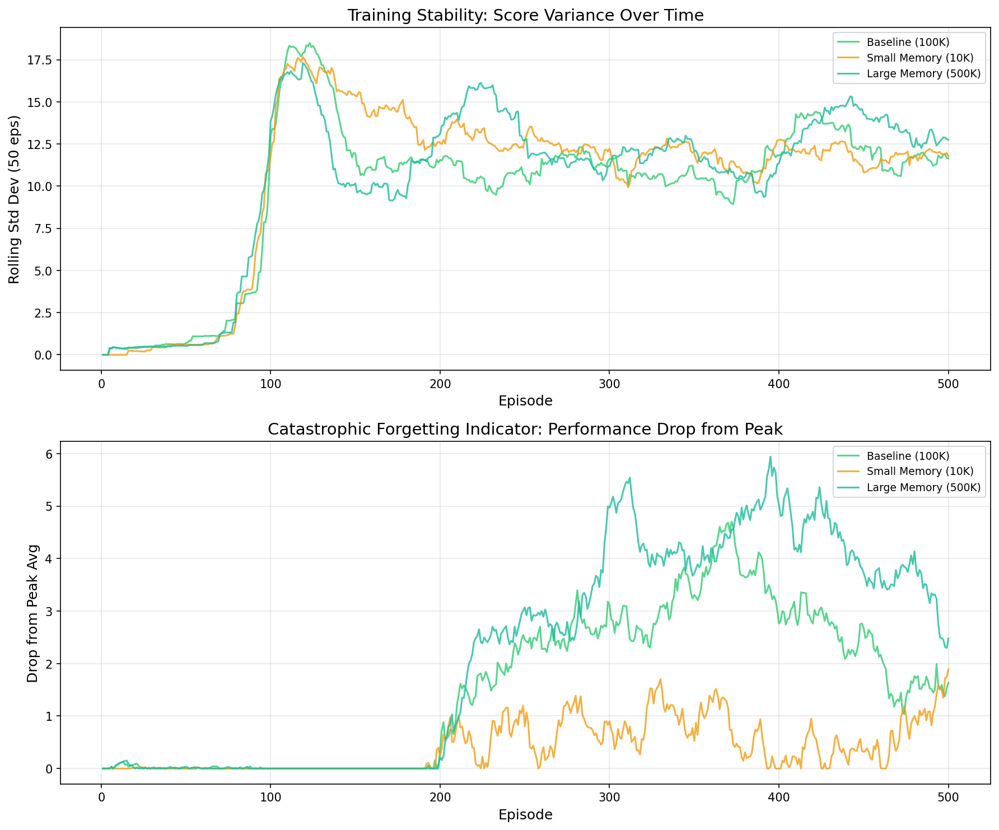

# Analysis of Snake Reinforcement Learning Modifications

## Introduction

### Overview of RL and DQNs
Reinforcement Learning (RL) is a paradigm of machine learning where an agent learns to make decisions by performing actions in an environment and receiving feedback in the form of rewards or penalties. Deep Q-Networks (DQN) combine Q-learning with deep neural networks to approximate the optimal action-value function, enabling agents to handle high-dimensional state spaces.

### Purpose of the Experiment
The objective of this assessment is to systematically modify a baseline Snake RL agent to observe how changes in neural network architecture, replay memory size, and environment complexity affect learning performance. Understanding these relationships is critical for applying RL to real-world domains such as autonomous driving, robotics, and precision medicine, where configuration and environmental adaptability are key.

## Methodology

### Baseline Setup
- **Environment**: Headless Snake game (grid-based).
- **State Space**: 11 inputs (danger detection, direction, food location).
- **Action Space**: 3 actions (straight, left, right).
- **Agent**: DQN with epsilon-greedy exploration.
- **Baseline Architecture**: Input(11) → Hidden(256) → Output(3).
- **Baseline Memory**: 100,000 max experiences.

### Modifications
All experiments were run for 500 episodes.

1.  **Neural Network Architecture (Part B)**:
    -   *Wide*: 1 hidden layer with 512 neurons.
    -   *Deep (4 hidden)*: 11 → 256 → 256 → 128 → 64 → 3.
    -   *Deep (6 hidden)*: 11 → 256 → 256 → 256 → 128 → 128 → 64 → 3.

2.  **Replay Memory Size (Part C)**:
    -   *Small*: 10,000 experiences.
    -   *Large*: 500,000 experiences.

3.  **Environment Complexity (Part D)**:
    -   Introduction of a static wall obstacle in the center of the grid.
    -   Repetition of architecture and memory experiments within this constrained environment.

## Results

### Training Curves

### Summary of Performance

| Experiment | Architecture | Memory | Wall | Final Avg (100) | Record |
| :--- | :--- | :--- | :--- | :--- | :--- |
| **Part A** | | | | | |
| Baseline | 11→256→3 | 100K | No | 32.19 | 71 |
| **Part B** | | | | | |
| Wide | 11→512→3 | 100K | No | 32.07 | 70 |
| Deep (4h) | 11→...→3 | 100K | No | 0.01 | 2 |
| Deep (6h) | 11→...→3 | 100K | No | 0.00 | 1 |
| **Part C** | | | | | |
| Small Mem | 11→256→3 | 10K | No | 33.17 | 70 |
| Large Mem | 11→256→3 | 500K | No | 34.27 | 77 |
| **Part D** | | | | | |
| Wall Baseline | 11→256→3 | 100K | Yes | 3.23 | 40 |
| Wall Wide | 11→512→3 | 100K | Yes | 4.71 | 42 |
| Wall Deep (4h) | 11→...→3 | 100K | Yes | 0.05 | 1 |
| Wall Deep (6h) | 11→...→3 | 100K | Yes | 0.01 | 1 |
| Wall Small Mem | 11→256→3 | 10K | Yes | 2.43 | 25 |
| Wall Large Mem | 11→256→3 | 500K | Yes | 3.15 | 29 |

*(See `experiment_summary.csv` for full data)*

## Discussion

### Baseline vs. Modifications
-   **Network Architecture**: 
    -   *Wide vs Baseline*: Performance was very similar (32.07 vs 32.19). However, with the wall obstacle, the Wide network outperformed the baseline (4.71 vs 3.23), suggesting that the additional capacity helped learn more complex spatial features required for obstacle avoidance.
    -   *Deep Networks*: Deep networks (4 and 6 hidden layers) failed to learn effectively within 500 episodes (Avg ~0). This is likely due to the vanishing gradient problem or the difficulty of propagating rewards through many layers with sparse rewards (snake death/eating). They require more sophisticated training stability techniques or longer training.
-   **Replay Memory**:
    -   *Small Memory*: Performed surprisingly well in the open environment (33.17), likely because recent experiences were sufficient. However, in the wall environment, it underperformed (2.43 vs 3.23), suggesting that forgetting older experiences hurts when the environment has "traps" or obstacles that don't occur every step.
    -   *Large Memory*: Gave the highest overall score in the open environment (34.27), indicating better stability.
-   **Environment Complexity**:
    -   *Impact of Wall*: The wall massively increased difficulty. Average scores dropped from ~32 to ~3. Agents struggled to navigate around the static obstacle, likely getting trapped or colliding frequently.

### Challenges Observed
-   **Convergence**: Deep networks showed almost no convergence (scores stayed near 0).
-   **Stability**: Large memory provided the best stability. Wide networks showed promise in complex environments.

## Ethical Considerations of AI in Industry

The deployment of reinforcement learning and generative AI in industry carries significant ethical obligations.

-   **Bias and Fairness**: AI models trained on specific environments or datasets may fail to generalize, potentially disadvantaging certain groups if applied to human-centric decision making (e.g., loan approval, hiring). In RL, reward content shaping can introduce unintended biases.
-   **Transparency and Accountability**: "Black box" nature of deep neural networks (like the 6-hidden layer model used here) makes it difficult to explain *why* an agent made a specific decision. In safety-critical systems like autonomous vehicles, this is a major hurdle for certification and trust.
-   **Safety and Reliability**: As seen in the wall experiments, environmental changes can drastically affect performance. An agent trained in an open field may fail catastrophically when an obstacle (wall) is introduced. Ensuring safe behavior in unseen "out-of-distribution" scenarios is a key challenge in AI safety.
-   **Compute Costs and Sustainability**: Training larger networks (e.g., Part B's deep models) requires significantly more FLOPs and energy. The environmental footprint of training massive models must be weighed against their utility.

## Conclusion

This study demonstrated the impact of hyperparameters on RL agent performance. 

Key findings:

1. **Network depth without architectural safeguards causes learning failure.** Deep networks (4 and 6 hidden layers) achieved near-zero performance (0.01 and 0.00 average scores) due to vanishing gradient problems, while the shallow baseline and wide networks learned effectively. This validates that simply adding layers does not improve DQN performance without techniques like batch normalisation or residual connections.

2. **Larger replay buffers improve performance in standard environments.** The 500K memory configuration achieved the highest average score (34.27) and record (77), outperforming both the baseline (32.19) and small memory (33.17). Greater sample diversity helps break temporal correlations and stabilise learning.

3. **Network width provides robustness to environmental complexity.** When wall obstacles were introduced, the wide network (4.71 average) outperformed all other configurations, showing 46% improvement over the wall baseline (3.23). Increased single-layer capacity aids adaptation to complex spatial features.

4. **Environmental changes drastically impact agent performance.** The wall obstacle reduced baseline performance by 90% (32.19 to 3.23), highlighting the brittleness of RL agents to distributional shift—a critical concern for real-world deployment.

The Snake environment also revealed fundamental RL limitations: sparse reward structures provide limited credit assignment guidance, and epsilon-greedy exploration is relatively crude. Future improvements could include Prioritized Experience Replay (Schaul et al., 2015) to focus on important transitions like wall collisions, Dueling DQN architectures to separate state-value from action-advantage estimation, and Double DQN to reduce Q-value overestimation bias that contributes to learning instability.

## References

1.  Mnih, V., et al. (2015). "Human-level control through deep reinforcement learning." *Nature*.
2.  Sutton, R. S., & Barto, A. G. (2018). *Reinforcement Learning: An Introduction*. MIT Press.
3.  Schaul, T., et al. (2015). "Prioritized Experience Replay." *ICLR*.
4.  PyTorch Documentation. https://pytorch.org/
